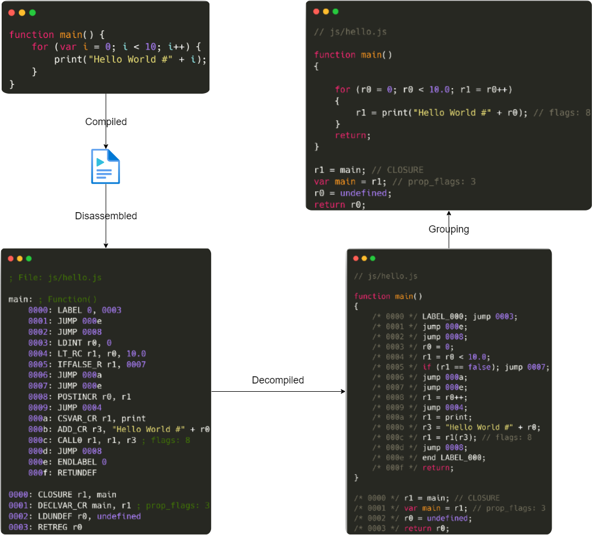

Detaped
=======

Introduction
------------

Detaped is a Python disassembler and decompiler for [Duktape](https://duktape.org/) ([GitHub](https://github.com/svaarala/duktape)). The intended use is for source code review and analysis in situations where you only have the compiled [Duktape](https://duktape.org/) bytecode binary, such as in a black-box assessment.

Features
------------

* Parses JSE file format
* Disassemble JSE binary, or directory of binaries
* Produces ASM style instructions (one-to-one bytecode mapping)
* Produces low-level JavaScript "like" output
* Decompiler produces basic high-level JavaScript "like" output

Supported Versions
------------

* v2.7.0

Usage
------------

```
└─$ detaped --help                                           
usage: detaped.py [-h] [-o OUTPUT] [-a ASM] [-t TXT] [-n] [-v {none,normal,debug}]
                  [--disable-grouping] [--disable-call] [--disable-jump] [--disable-if-else]
                  [--disable-if-condition] [--disable-try-catch-finally] [--disable-for-loop]
                  [--disable-while-loop] [--disable-init-array] [--disable-init-object]
                  [--disable-get-prop] [--disable-join-operator] [--disable-double-return]
                  input

Duktape JavaScript bytecode decompiler

positional arguments:
  input                 The Duktape bytecode file or directory to be decompiled.

options:
  -h, --help            show this help message and exit
  -o OUTPUT, --output OUTPUT
                        The decompiled output JavaScript file or directory.
  -a ASM, --asm ASM     The output JavaScript ASM file or directory.
  -t TXT, --txt TXT     The command output text file.
  -n, --no-ansi         Disable ANSI color output.
  -v {none,normal,debug}, --verbosity {none,normal,debug}
                        The script output verbosity mode. (Default "normal")

Decompiler Grouping:
  Disable specific decompiler grouping functionality.

  --disable-grouping    Disables all grouping functionality.
  --disable-call        Disables call grouping.
  --disable-jump        Disables jump block grouping.
  --disable-if-else     Disables if/else block grouping.
  --disable-if-condition
                        Disables grouping if statement with preceding condition.
  --disable-try-catch-finally
                        Disables try/catch/finally block grouping.
  --disable-for-loop    Disables for loop block grouping.
  --disable-while-loop  Disables while loop block grouping.
  --disable-init-array  Disables grouping array initialization.
  --disable-init-object
                        Disables grouping object initialization properties.
  --disable-get-prop    Disables grouping get properties.
  --disable-join-operator
                        Disables grouping join operators.
  --disable-double-return
                        Disables grouping return undefined after return.
```

Example
------------

The following diagram shows how a simple JavaScript file is transformed into the various states.

1. Compilation - The original file is compiled using [Duktape](https://duktape.org/) into bytecode.
2. Parser - The bytecode file structure is parsed using Detaped.
3. Disassembler - The parsed bytecode is disassembled into an ASM like file.
4. Decompiler - The disassembled data is decompiled to a JavaScript like file.
5. Grouping - Common decompiled patterns are grouped to a higher-level JavaScript like file.

